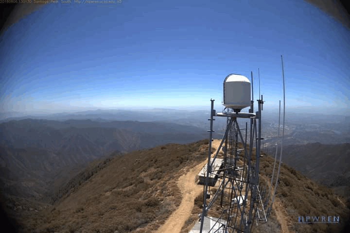
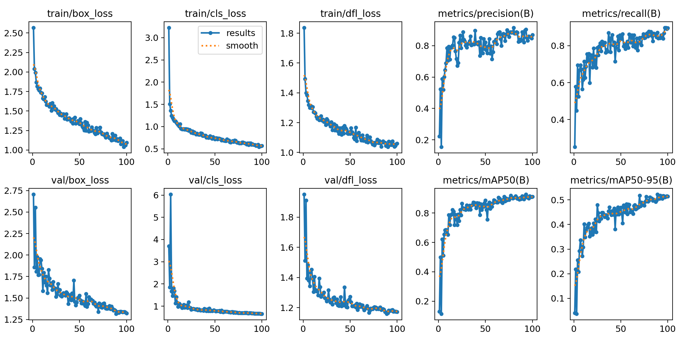

# Fire-Smoke Detection - YOLOv11

## Introduction
This project is object detection, which can be utilized for detecting smoke. Not only that, it can be utilized for preventing wildfires. You can access the datasets from this [resource](https://universe.roboflow.com/brad-dwyer/wildfire-smoke). 

For detecting object on image, i utilize YOLOv11 from ultralytics and build a web app from streamlit for demo this project. If you want to try run locally, you can run with this command:
```streamlit run app.py```



## Response
```
cls: tensor([0.], device='cuda:0')
conf: tensor([0.8254], device='cuda:0')
data: tensor([[515.5414, 207.8445, 615.1335, 285.1855,   0.8254,   0.0000]], device='cuda:0')
id: None
is_track: False
orig_shape: (480, 640)
shape: torch.Size([1, 6])
xywh: tensor([[565.3375, 246.5150,  99.5921,  77.3410]], device='cuda:0')
xywh: tensor([[565.3375, 246.5150,  99.5921,  77.3410]], device='cuda:0')
xywhn: tensor([[0.8833, 0.5136, 0.1556, 0.1611]], device='cuda:0')
xyxy: tensor([[515.5414, 207.8445, 615.1335, 285.1855]], device='cuda:0')
xyxyn: tensor([[0.8055, 0.4330, 0.9611, 0.5941]], device='cuda:0')
```

## Model Performance



